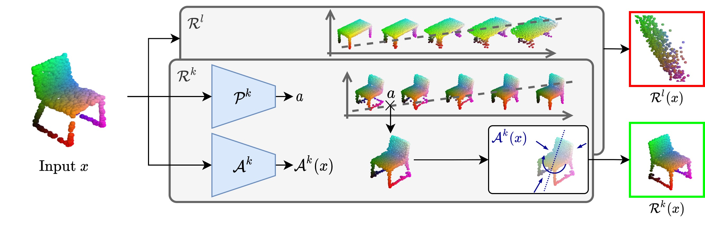

# deep-linear-shapes

PyTorch implementation of "Representing Shape Collections with Alignment-Aware Linear Models" paper.



If you find this code useful in your research, please cite:

```
@misc{loiseau2021representing,
      title={Representing Shape Collections with Alignment-Aware Linear Models}, 
      author={Romain Loiseau and Tom Monnier and Mathieu Aubry and Loïc Landrieu},
      year={2021},
      eprint={2109.01605},
      archivePrefix={arXiv},
      primaryClass={cs.CV}
}
```

[paper](https://arxiv.org/abs/2109.01605) | [webpage](https://romainloiseau.github.io/deep-linear-shapes/)

## Installation :star2:

### 1. Create and activate conda environment

```
conda env create -f environment.yml
conda activate dls
```

**Optional:** some monitoring routines are implemented with `tensorboard`.

**Note:** this implementation uses [torch-points3d](https://github.com/nicolas-chaulet/torch-points3d) and an adapted version of their datasets.

### 2. Update submodules to use Chamfer Distance

Our implementation uses an efficient GPU implementation of Chamfer Distance to speed-up training taken from [this repository](https://github.com/ThibaultGROUEIX/ChamferDistancePytorch) and used as a submodule. To properly use this implementation run:

```
git submodule init
git submodule update
```

### 3. Download non-torch-points3d datasets

Execute `bash` scripts in the folder `dlm/datasets/AtlasNetData`. These files are taken from [this repository](https://github.com/ThibaultGROUEIX/AtlasNet).

## How to use :rocket:

### 1. Train a model

```
python run.py
```

Results are saved at `runs/`. Some options can be found in the file `dlm/utils/parser` or by running the command `python run.py -h`.
Some training visual results like prototype evolutions and transformation prediction examples will be 
saved in a `tensorboard` file. Here is an example of learned prototypes on the ABC dataset:


### 2. Notebooks

Some explanatory notebooks are available in the folder `notebooks/`.
